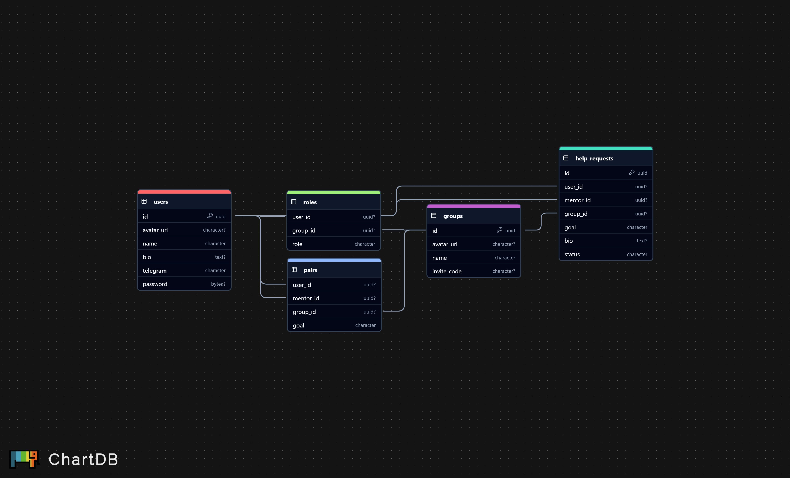

# Mentor Link - Система наставничества

## Общая архитектура

### Компоненты системы

Проект включает следующие основные компоненты:

#### 1. Mobile APP
- Основной интерфейс взаимодействия с пользователем
- Обеспечивает доступ ко всем функциям системы
- Взаимодействует с backend через REST API и Websocket для реалтайм обновления данных

#### 2. Backend API
- Написан на Go
- Использует фреймворк gin для работы с HTTP и gorilla/mux для работы с Websocket для реалтайм обновления данных
- Имеет документацию swagger для всех доступных методов
- Управляет бизнес-логикой и доступом к данным
- Использует библиотеку GORM для работы с базой данных и S3 хранилищем

#### 3. СУБД PostgreSQL
- Хранит все структурированные данные приложения
- Взаимодействует с Backend посредством SQL запросов

#### 4. Minio S3
- Используется для хранения изображений пользователей и групп
- Выдает ссылки с read-only доступом к ним

### Схема взаимодействия компонентов


## Структура проекта

```
lotti/
├── cmd/                          # Точка входа в приложение
│   └── main.go                   # Основной файл запуска приложения
├── deploy/                       # Файлы для развертывания приложения
├── docs/                         # Документация проекта
├── internal/                     # Внутренний код приложения
│   ├── app/                      # Основная логика приложения
│   │   ├── helpers/             # Вспомогательные функции
│   │   ├── httpError/           # Стандартизация HTTP ошибок
│   │   └── Validators/          # Валидаторы запросов и данных
│   ├── connetions/              # Подключения к внешним сервисам
│   │   ├── db/                  # Подключение к PostgreSQL
│   │   └── minio/               # Подключение к Minio S3
│   ├── models/                  # Модели данных для базы данных
│   ├── pkg/                     # Общие пакеты
│   │   └── config/             # Конфигурация приложения
│   ├── repository/             # Реализация репозиториев
│   │   ├── group/             # Репозиторий для работы с группами
│   │   ├── mentor/            # Репозиторий для работы с менторами
│   │   ├── minio/             # Репозиторий для работы с S3 хранилищем
│   │   └── user/              # Репозиторий для работы с пользователями
│   ├── service/               # Реализация бизнес-логики
│   │   ├── group/            # Сервис для работы с группами
│   │   ├── mentor/           # Сервис для работы с менторами
│   │   └── user/             # Сервис для работы с пользователями
│   └── transport/            # Реализация транспортного уровня
│       └── http/            # HTTP транспорт
│           ├── handler/     # Обработчики HTTP запросов
│           │   ├── ApiRouters/  # Роутеры API
│           │   ├── group/       # Обработчики для групп
│           │   ├── mentor/      # Обработчики для менторов
│           │   ├── public/      # Публичные обработчики
│           │   ├── user/        # Обработчики для пользователей
│           │   └── ws/          # WebSocket обработчики
│           ├── middleware/      # Промежуточные обработчики
│           └── pkg/            # Вспомогательные пакеты
│               └── jwt/        # Работа с JWT токенами
├── jobs/                      # Задачи для CI/CD
├── migrations/                # Миграции базы данных
└── tests/                    # Тесты
    ├── image/                # Тестовые изображения
    └── migrations/           # Тестовые миграции
```

## База данных

### ER-диаграмма



### Основные сущности

#### 1. User
- ID (UUID)
- Name (unique)
- AvatarURL
- BIO
- Telegram

#### 2. Group
- ID (UUID)
- Name
- AvatarURL
- InviteCode

#### 3. Role
- UserID (UUID)
- GroupID (UUID)
- Role (string)

#### 4. HelpRequest
- ID (UUID)
- UserID (UUID)
- MentorID (UUID)
- GroupID (UUID)
- Goal
- BIO
- Status

#### 5. Pair
- UserID (UUID)
- MentorID (UUID)
- GroupID (UUID)
- Goal

### Особенности и связи

1. **Пользователи (User)**
   - Вступают в группы по уникальным кодам приглашения
   - Могут быть членами множества групп через таблицу Role
   - Создают запросы на помощь (HelpRequest)
   - Выступают наставниками или студентами в парах (Pair)

2. **Организации (Group)**
   - Содержат множество участников через таблицу Role
   - Имеют запросы на помощь
   - Создают уникальный код приглашения

3. **Система ролей**
   - Реализована через таблицу Role
   - Связывает пользователей с организациями
   - Определяет права доступа

4. **Запросы на помощь (HelpRequest)**
   - Связывают студента, наставника и организацию
   - Имеют статус и цель
   - Преобразуются в пары

5. **Пары наставник-студент (Pair)**
   - Создаются из принятых запросов на помощь
   - Привязаны к организации
   - Имеют определенную цель взаимодействия

## CI/CD-конфигурация
[Репозиторий с файлом пайплайнов и директорией джобов](https://github.com/xLeSHka/mentorLinkSchool)

### Описание pipeline
1. Включаем jobs`ы в pipeline
2. Определяем скирпт выставления глобальных переменных
3. Определяем стадии CI/CD
4. Переходим на стадию билда
5. Запускаем скрипт билда и проверки правил CI/CD
6. Переходим к стадии деплоя
7. Устанавливаем переменные
8. Запускаем скрипт поднятия докер компоуза, установки глобальных переменных и проверки правил CI/CD

[Логи успешного деплоя](https://github.com/xLeSHka/mentorLinkSchool/-/pipelines/19578)

## Исходный код
[Ссылка на проект с репозиториями в GitLab](https://gitlab.prodcontest.ru/team-14)

## API-Документация

Документация по взаимодействию с REST API сервера представлена в формате swagger и доступна по следующему адресу: [https://prod-team-14-mkg8u20m.final.prodcontest.ru/api/docs/index.html](https://prod-team-14-mkg8u20m.final.prodcontest.ru/api/docs/index.html)  
Актуальность документации достигается благодаря автогенерации документации при запуске CI
### Работа с Swagger UI 
Для всех запросов кроме `/user/auth/sign-in` требуется токен аутентифицации в заголовке чтобы определить кто отправил запрос
Тестовые данные:
1. Владелец. Владелец Организации. Логин: `Сваггер Пользователь 1`
2. Пользователь: Студент. Логин: `Сваггер Пользователь 2`
3. Пользователь. Студент. Логин: `Сваггер Пользователь 3`
4. Пользователь. Ментор. Логин: `Сваггер Пользователь 4`
5. Пользователь. Ментор. Логин: `Сваггер Пользователь 5`

## Тесты
Если у вас есть `Taskfile` или `Make` вы можете ввести `task run_tests` или `make run_tests` в терминале.
Иначе можно просто ввести последовательно 3 команды
```bash
    docker-compose -f docker-compose.test.yml up -d
    go test  ./tests/... -timeout 120s -v -coverpkg=./internal/transport,./internal/service/...,./internal/repository/...,./internal/pkg/...,./internal/connections/...
    docker-compose -f docker-compose.test.yml down -v
```
После прохождения тестов будет выведен процент покрытия кода тестами.
### Покрытие тестами
Тестами покрыты все методы транспортного, сервисного слоя и слоя репозиториев, все соединения и пакеты